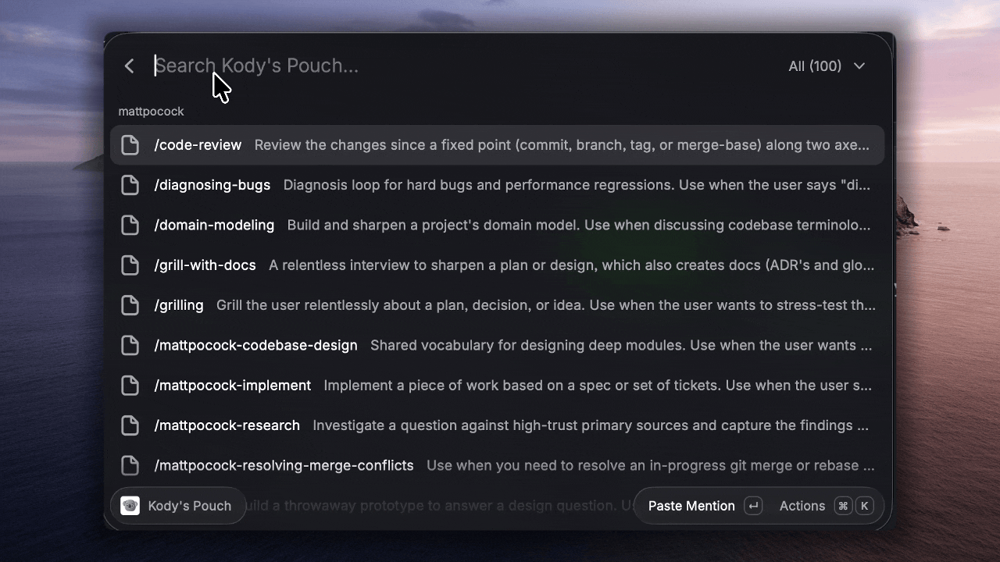

# Kody's Pouch

Raycast window into Kody's Pouch. Search Tools and Skills. Pick one to paste a Mention into the Active Input. If there is no Active Input, the Mention is copied.

Kody is the source of truth. This extension does not read disk skills or write stubs.

## Setup

1. Create a token: [Personal Raycast token](https://kody.codes/account/package-invocation-tokens/new?name=Personal%20Raycast&packageKodyIds=*&exportNames=*&sources=raycast)
2. `npm install && npm run dev`
3. Open **Kody's Pouch** in Raycast
4. Set preferences: base URL (`https://kody.codes`), username, token, discovery id (`raycast`)

Do not paste the token into chat.

`author` in `package.json` is a Raycast Store handle. Change it before you publish. Local `npm run dev` works without that.

## Use

Open **Kody's Pouch**. Type to filter. Pick a row. The Mention pastes at the caret. Use Copy Mention for the clipboard.
